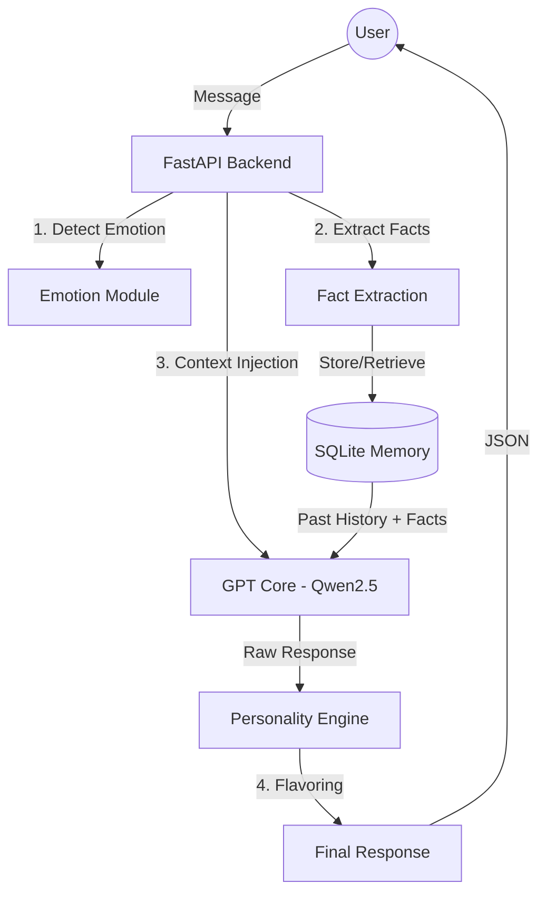

# Aura AI: Your Emotionally Aware Companion 🤖✨

Aura is a personalized AI assistant designed to be more than just a chatbot. She remembers your preferences, understands your mood, and adapts her personality to match yours. Built with industry-standard practices, Aura is a showcase of modular AI architecture and persistent long-term memory.

---

## 🚀 Key Features

- **🧠 "Big Sibling" Long-Term Memory**: Aura doesn't just remember the current chat; she extracts facts (hobbies, names, preferences) and stores them in a permanent "Fact File" to personalize future interactions.
- **🎭 Dynamic Personality Engine**: Switch between multiple modes (Supportive, Playful, Sarcastic, etc.) that affect not just the AI's logic, but its emotional "flavoring."
- **🌈 Emotion Awareness**: Real-time sentiment analysis allows Aura to react visually and textually to your mood.
- **📱 Modern Web Interface**: A sleek, Tailwind CSS-powered "glassmorphism" UI with interactive emotional feedback.
- **🐳 Production Ready**: Fully Dockerized with CI/CD integration and automated testing.

---

## 🛠️ Technical Stack

- **Backend**: FastAPI (Python 3.13)
- **LLM Core**: Qwen/Qwen2.5-3B-Instruct (Quantized via BitsAndBytes for 4GB GPUs)
- **Database**: SQLite (Persistent history & user preferences)
- **Frontend**: HTML5/Tailwind CSS/JS (Glassmorphism design)
- **DevOps**: Docker, Docker Compose, GitHub Actions (CI/CD)
- **ML Libraries**: Transformers, Torch, Peft, Scikit-learn

---

## 📐 Architecture



---

## 🔧 Getting Started

### Prerequisites
- Python 3.13+
- CUDA-compatible GPU (Recommended 4GB+ VRAM for local LLM)
- Hugging Face Token

### Local Setup
1. **Clone the repository**:
   ```bash
   git clone https://github.com/your-username/aura-ai.git
   cd aura-ai
   ```
2. **Install Dependencies**:
   ```bash
   pip install -r requirements.txt
   ```
3. **Configuration**:
   Create a `.env` file in the root directory:
   ```env
   HF_TOKEN=your_huggingface_token
   ```
4. **Run the API**:
   ```bash
   python -m src.api.app
   ```
5. **Open the UI**:
   Open `chat.html` in your favorite browser.

### Docker Setup
```bash
docker-compose up --build
```

---

## 🧪 Technical Challenges & Solutions

### 1. Memory Management on Small GPUs
**Challenge**: Running a 3B-parameter model on a 4GB RTX 3050.
**Solution**: Implemented `BitsAndBytes` 4-bit quantization (NF4) and `torch.cuda.empty_cache()` calls to keep the VRAM footprint under 3.5GB.

### 2. The "Double Flavor" Bug
**Challenge**: Early versions had the AI sounding repetitive because personality text was appended *after* the model had already generated a response.
**Solution**: Moved personality traits into the **System Prompt** for "natural" personality, while keeping the external engine for "reactive" emotional flavor.

### 3. Fact Extraction Precision
**Challenge**: Identifying personal facts (e.g., "I love soccer") without catching generic statements.
**Solution**: Engineered a specialized Fact Extraction prompt using a separate LLM pass that outputs structured JSON for direct database insertion.

---

## 📈 Roadmap
- [ ] **Voice Synthesis**: Local TTS using Piper/Kokoro.
- [ ] **Physical Form**: Animated Rive/Lottie character that reacts to emotions.
- [ ] **Mobile App**: Dedicated Flutter-based mobile client.
- [ ] **Wake Word**: "Hey Aura" activation for hands-free use.

---

## 📄 License
MIT License - Feel free to use this for your own portfolio!
