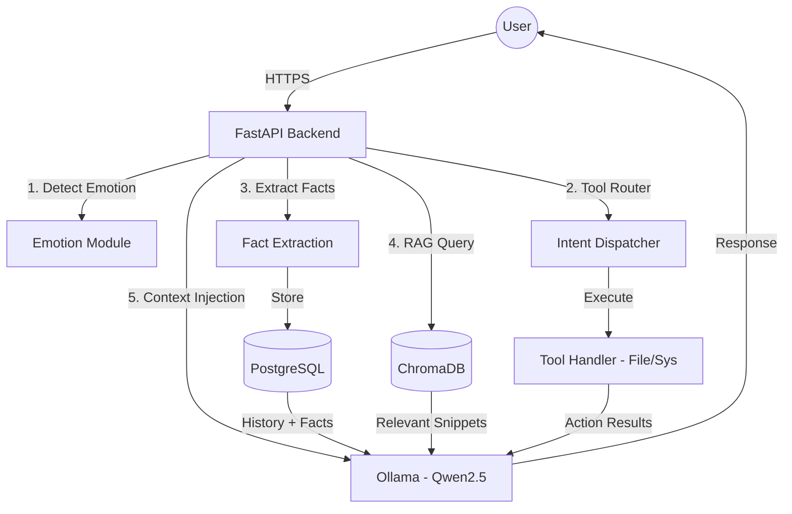

# Aura AI: Your Emotionally Aware Companion 🤖✨

Aura is a personalized AI assistant designed to be more than just a chatbot. She remembers your preferences, understands your mood, and adapts her personality to match yours. Built with industry-standard practices, Aura is a showcase of modular AI architecture, persistent long-term memory, and autonomous agency.

---

## 🚀 Key Features

- **🧠 "Big Sibling" Long-Term Memory**: Aura doesn't just remember the current chat; she extracts facts (hobbies, names, preferences) and stores them in a permanent "Fact File" to personalize future interactions.
- **🎭 Dynamic Personality Engine**: Switch between multiple modes (Architect, Code Review, etc.) that affect not just the AI's logic, but its emotional "flavoring."
- **🌈 Emotion-Reactive Visuals**: Real-time sentiment analysis allows Aura's background and avatar to react visually to your mood.
- **🛠️ Autonomous Agency (Tool Use)**: Aura can now execute actions on your system, such as creating folders, managing files, and checking system status within a secure workspace.
- **📱 Responsive Dashboard**: A modern, mobile-friendly React interface with glassmorphism design and real-time system monitoring.
- **🛡️ Hardened Security**: Implementation of JWT authentication, rate limiting (SlowAPI), and secure HTTP headers.

---

## 🛠️ Technical Stack

- **Backend**: FastAPI (Python 3.13)
- **LLM Engine**: Ollama (Running Qwen 2.5 local inference)
- **Database**: PostgreSQL (Users/History) & ChromaDB (Vector RAG)
- **Frontend**: React 19 (TypeScript) + Tailwind CSS 4 + Framer Motion
- **DevOps**: Docker, Docker Compose, Prometheus Monitoring
- **ML Libraries**: Transformers, Sentence-Transformers, Scikit-learn

---

## 📐 Architecture



---

## 🔧 Getting Started

### Prerequisites
- Python 3.13+
- [Ollama](https://ollama.com/) (Local LLM Runtime)
- PostgreSQL (or use Docker)

### Local Setup
1. **Clone the repository**:
   ```bash
   git clone https://github.com/your-username/aura-ai.git
   cd aura-ai
   ```
2. **Install Dependencies**:
   ```bash
   pip install -r requirements.txt
   ```
3. **Download the Model**:
   ```bash
   ollama pull qwen2.5:1.5b
   ```
4. **Run the API**:
   ```bash
   python -m src.api.app
   ```
5. **Start the UI**:
   ```bash
   cd aura-ui
   npm install
   npm run dev
   ```

---

## 🧪 Technical Challenges & Solutions

### 1. The "Hallucination" Loop
**Challenge**: Smaller LLMs (1.5B) often hallucinate terminal commands (e.g., typing `mkdir`) instead of calling actual Python functions.
**Solution**: Implemented a **Two-Pass Agency System**. The first pass strictly identifies tool intent, and the second pass handles the conversational response using the real tool output.

### 2. Security & Workspace Isolation
**Challenge**: Allowing an AI to manage files poses security risks.
**Solution**: All file operations are restricted to a dedicated `aura_workspace/` directory using strict path validation.

### 3. Mobile Responsiveness in Glassmorphism
**Challenge**: Maintaining complex CSS blurs and transparency while ensuring usability on small screens.
**Solution**: Built a custom responsive sidebar with Framer Motion and mobile-first Tailwind utilities.

---

## 📈 Roadmap
- [x] **Autonomous Agency**: Tool use for file/system management.
- [x] **Mobile Expansion**: Fully responsive dashboard.
- [x] **Local LLM Integration**: Full migration to Ollama.
- [ ] **Voice Synthesis**: Local TTS using Piper/Kokoro.
- [ ] **Vision**: Multi-modal support for image analysis.

---

## 📄 License
MIT License - Feel free to use this for your own portfolio!
